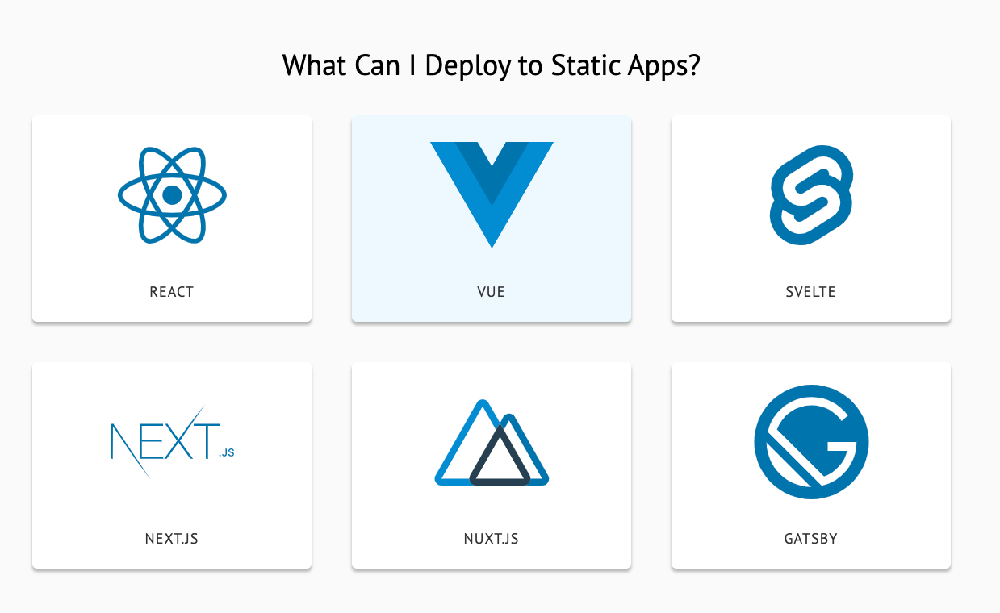

<h1 align="center">Terraform ECS NextJS APP.</h1>

## Tecnologias

* Terraform

## 🚨 Pré-requisitos

* Terraform Instalado
* Access Key ID
* Secret Access Key

## 🔧 Instruções de Instalação
1. Configure AWS
```
$ aws configure
```
2.  Clonar este repositório:
```
git clone https://github.com/guilhermerodriguesti/terraform-nextjs-ecs.git
cd terraform-nextjs-ecs/terraform
./deploy.sh
```

## 🔧 Test

http://ecs-nodejs-app-dev-load-balancer-1288290033.us-east-1.elb.amazonaws.com:3000/



## Output Example
```
Apply complete! Resources: 35 added, 0 changed, 0 destroyed.

Outputs:

alb_url = "ecs-nodejs-app-dev-load-balancer-1288290033.us-east-1.elb.amazonaws.com"
cluster_arn = "arn:aws:ecs:us-east-1:433519261547:cluster/ecs-nodejs-app-dev-cluster"
cluster_name = "ecs-nodejs-app-dev-cluster"
ecs_service_id = "arn:aws:ecs:us-east-1:433519261547:service/ecs-nodejs-app-dev-cluster/ecs-nodejs-app-dev-service"
log_group = "arn:aws:logs:us-east-1:433519261547:log-group:/ecs/ecs-nodejs-app-dev:*"
repository_name = "ecs-nodejs-app-dev-repository"
repository_url = "433519261547.dkr.ecr.us-east-1.amazonaws.com/ecs-nodejs-app-dev-repository"
task_definition_arn = "arn:aws:ecs:us-east-1:433519261547:task-definition/ecs-nodejs-app-dev-task-definition:1"
----------------------------------------
Done!
----------------------------------------
Cleaning up plan file
----------------------------------------
```

## 🤝 Contribuições

Contribuições, problemas e solicitações são bem-vindos.<br />

## Author

👤 **Guilherme Rodrigues**

## 📝 Licença
